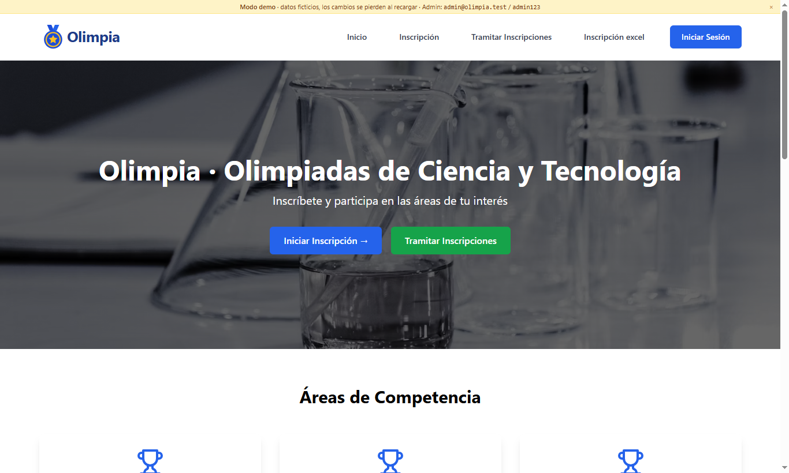
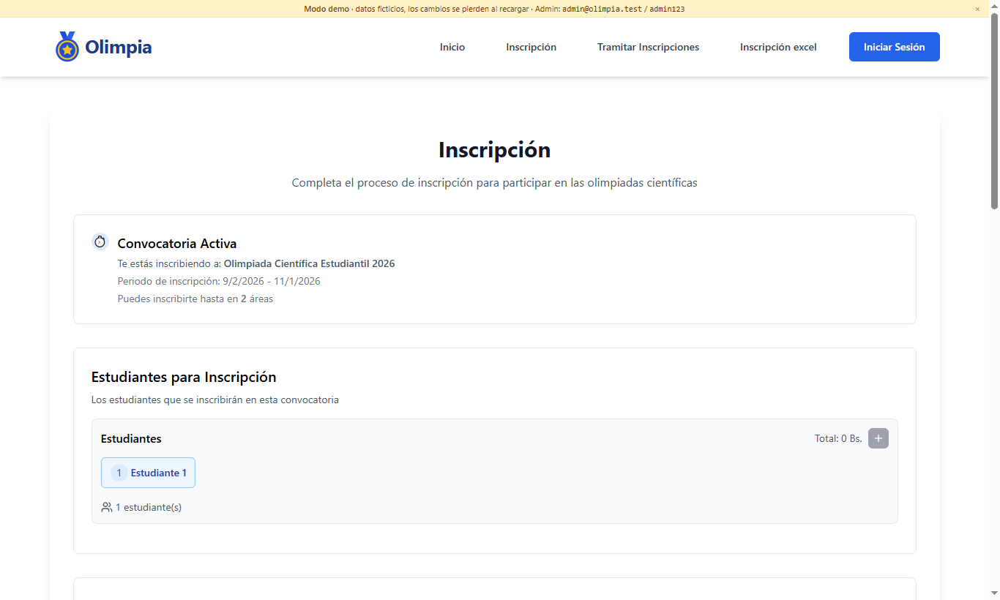
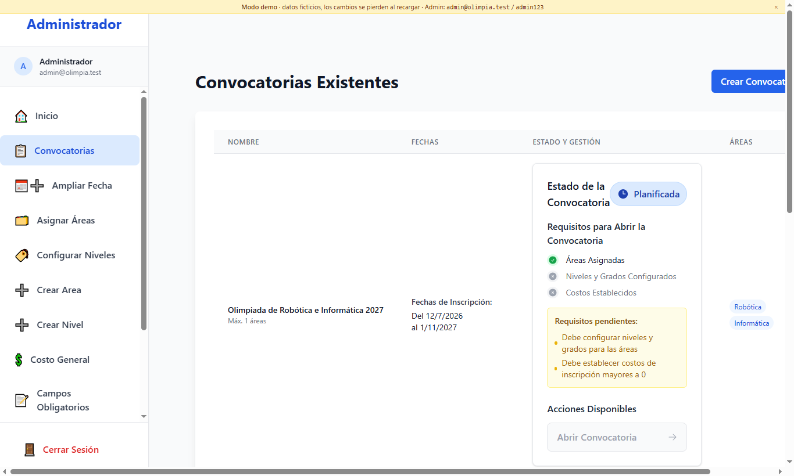
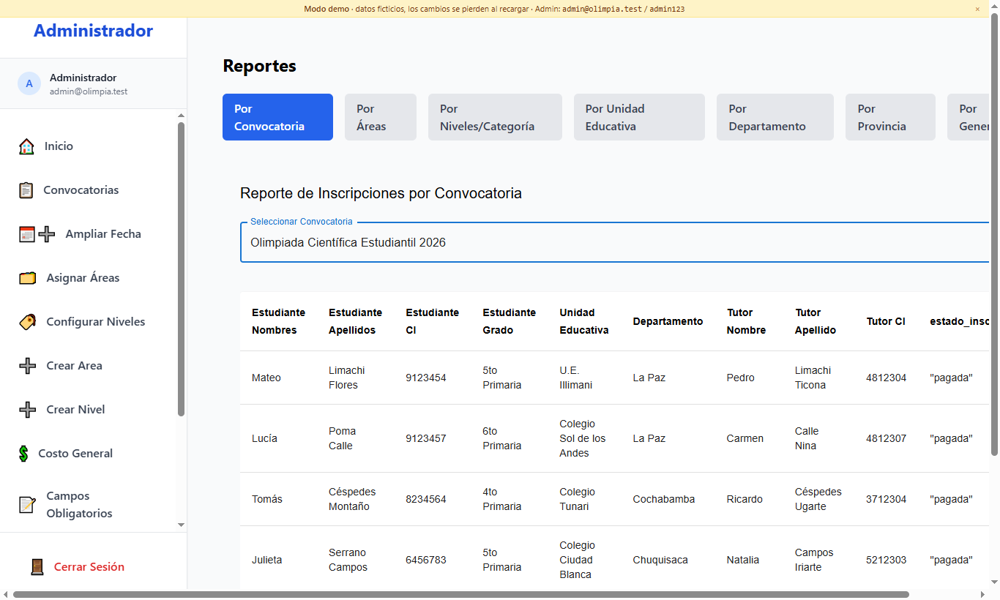
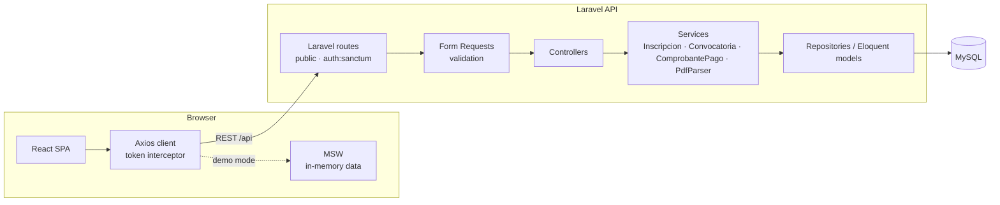

# Olimpia

**Registration platform for academic olympiads** — calls for participation, student registration (form or Excel), payment slips, automatic payment-receipt verification from PDF, and reports.

**Demo:** runs entirely in the browser with fictitious data; use **“Entrar como administrador (demo)”** on the login page to open the admin panel.

> 🇪🇸 **Resumen:** Olimpia es un sistema de inscripción a olimpiadas académicas. El administrador crea convocatorias con áreas, niveles y costos; los tutores inscriben estudiantes (uno a uno o por Excel), descargan la boleta de pago y suben el recibo en PDF, que el sistema lee y valida automáticamente para confirmar el pago. Incluye panel de administración y reportes por área, nivel, colegio, departamento, provincia y género.



| Registration | Admin · Calls | Admin · Reports |
|---|---|---|
|  |  |  |

## Features

**Public (tutors and students)**
- Registration of one or several students per payment order, with the areas and levels allowed for each student's grade.
- Bulk registration from an Excel template generated for the open call.
- Payment slip (PDF) with a unique code (`OLP-YYYY-NNNNN`) and registration status lookup by ID number.
- Payment receipt upload: the PDF is parsed and checked against the order (code, amount and payer). If it matches, the order is marked as paid.

**Admin panel** (token-based auth with Sanctum)
- Calls for participation with a state machine (`planificada → abierta → cerrada/finalizada`) and opening prerequisites (areas, levels and costs configured).
- Areas, levels, grade ranges, fees, required form fields, deadline extensions and per-area attachments.
- Dashboard and 7 reports with PDF/Excel export.
- Login attempt tracking and security panel.

**Responsive** from 360px phones to desktop: collapsible navigation, an off-canvas admin sidebar, stacked cards and scrollable tables on small screens.

## Tech stack

| Layer | Technologies |
|---|---|
| Frontend | React 18, TypeScript (strict), Vite 5, Tailwind CSS, MUI, React Router, Axios, jsPDF, SheetJS |
| Backend | Laravel 8, PHP 7.4, Sanctum, PhpSpreadsheet, smalot/pdfparser |
| Database | MySQL (SQLite for local development and tests) |
| Demo & testing | MSW (Mock Service Worker), PHPUnit, GitHub Actions |

## Architecture



- **Monorepo:** `backend/` (REST API) and `frontend/` (SPA) live together; the frontend can be deployed alone in demo mode.
- **Layered backend:** routes → Form Requests → controllers → services → Eloquent, with API Resources for responses and a single error format.
- **Demo mode:** `VITE_DEMO_MODE=true` starts a service worker that answers the ~47 endpoints used by the UI with fictitious data that mirrors the real API responses. The regular build does not include the mocks.

## Getting started

### Requirements
PHP 7.4 with `pdo_sqlite`/`pdo_mysql`, Composer 2, Node 20+.

### Backend
```bash
cd backend
composer install
cp .env.example .env
php artisan key:generate
# SQLite: set DB_CONNECTION=sqlite and DB_DATABASE=<absolute path>/database/database.sqlite
# MySQL: create the "olimpia" database and adjust DB_* in .env
php artisan migrate --seed      # creates admin@olimpia.test / admin123
php artisan serve               # http://127.0.0.1:8000
```

### Frontend
```bash
cd frontend
npm install
cp .env.example .env            # VITE_API_URL=http://127.0.0.1:8000/api
npm run dev                     # http://localhost:5173
```

### Demo mode (no backend)
```bash
cd frontend
npm run dev:demo
```
To deploy the demo on Vercel, set the root directory to `frontend`. `vercel.json` already sets the build command (`npm run build:demo`) and the SPA rewrites.

## Tests and quality

```bash
cd backend && php artisan test          # PHPUnit on in-memory SQLite
cd frontend && npx tsc --noEmit -p tsconfig.app.json && npm run lint && npm run build
```
- Backend tests cover receipt parsing and upload (with generated PDFs) and the registration endpoint.
- The CI workflow (`.github/workflows/ci.yml`) runs the same checks on every push and pull request.

## Project structure

```
backend/
  app/Http/Controllers/Api   REST controllers
  app/Http/Requests          validation (Form Requests)
  app/Services               business logic (registration, calls, payments, PDF parsing)
  app/Repositories           data access helpers
  routes/api.php             public vs. auth:sanctum routes
  tests/                     feature and unit tests
frontend/
  src/api                    Axios client and API modules
  src/pages, src/components  UI
  src/mocks                  MSW handlers and seed data for demo mode
docs/                        screenshots and working notes
```

## License
[MIT](LICENSE)
